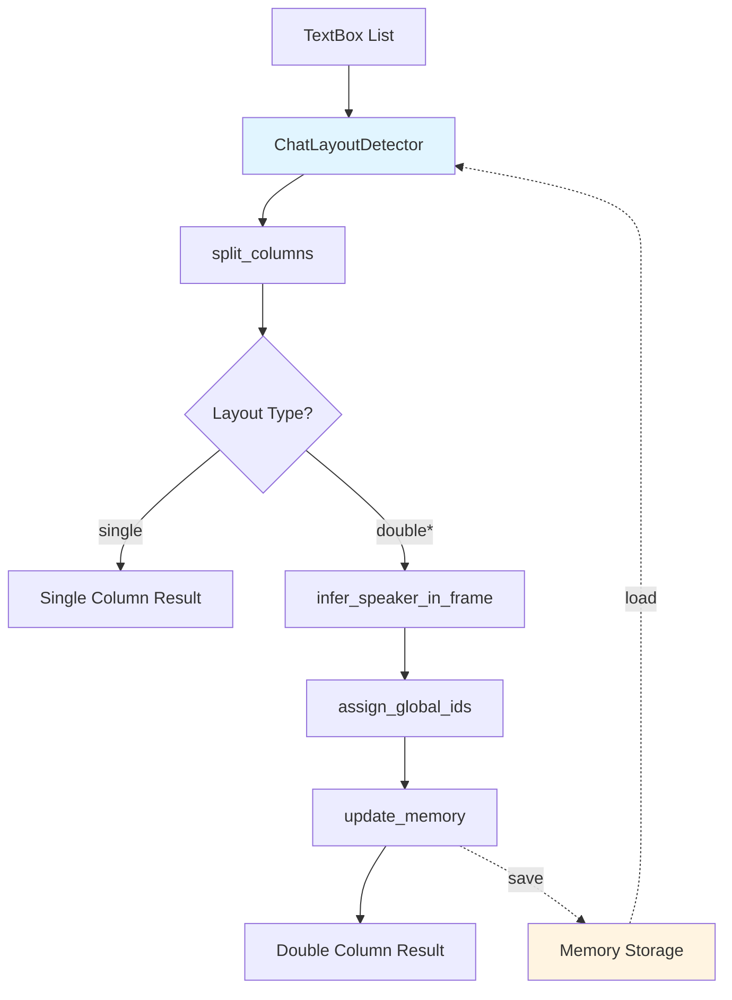

# Design Document

## Overview

本设计文档描述了聊天气泡检测系统的重构方案。系统将从基于YAML配置的应用特定方法转变为通用的、自适应的几何学习方法。核心设计理念是通过统计学习和跨截图记忆来自动识别聊天布局模式，无需任何应用类型先验知识。

系统采用三层架构：
1. **几何分析层** - 使用KMeans聚类分析center_x分布
2. **记忆学习层** - 维护跨截图的说话者几何特征
3. **匹配决策层** - 基于最小代价匹配分配说话者身份

## Architecture



系统工作流程：
1. 接收TextBox列表和屏幕宽度
2. 执行列分割和布局分类
3. 如果是双列布局，进行说话者推断
4. 与历史记忆匹配，分配全局说话者ID
5. 更新记忆并持久化
6. 返回结构化结果

## Components and Interfaces

### 1. ChatLayoutDetector 类

主要的检测器类，负责整个检测流程。

```python
class ChatLayoutDetector:
    def __init__(self, screen_width: int, 
                 min_separation_ratio: float = 0.18,
                 memory_alpha: float = 0.7,
                 memory_path: str = None):
        """
        初始化检测器
        
        Args:
            screen_width: 屏幕宽度（像素）
            min_separation_ratio: 最小列分离比例
            memory_alpha: 记忆更新的滑动平均系数
            memory_path: 记忆数据持久化路径
        """
        self.screen_width = screen_width
        self.min_separation_ratio = min_separation_ratio
        self.memory_alpha = memory_alpha
        self.memory_path = memory_path
        
        # 跨截图记忆
        self.memory = {
            "A": None,  # {"center": float, "width": float, "count": int}
            "B": None
        }
        
        self.frame_count = 0
        self._load_memory()
    
    def process_frame(self, boxes: List[TextBox]) -> Dict:
        """统一接口：处理单帧截图"""
        pass
    
    def split_columns(self, boxes: List[TextBox]) -> Tuple[str, List[TextBox], List[TextBox]]:
        """分割列并判断布局类型"""
        pass
    
    def infer_speaker_in_frame(self, left: List[TextBox], right: List[TextBox]) -> Dict:
        """单帧内推断说话者"""
        pass
    
    def update_memory(self, assigned: Dict):
        """更新跨截图记忆"""
        pass
    
    def calculate_temporal_confidence(self, boxes: List[TextBox], assigned: Dict) -> float:
        """计算基于时序规律的置信度"""
        pass
    
    def should_use_fallback(self) -> bool:
        """判断是否应该使用fallback方法"""
        pass
    
    def split_columns_median_fallback(self, boxes: List[TextBox]) -> Tuple[str, List[TextBox], List[TextBox]]:
        """使用median方法的fallback分列"""
        pass
    
    def _save_memory(self):
        """保存记忆到磁盘"""
        pass
    
    def _load_memory(self):
        """从磁盘加载记忆"""
        pass
```

### 2. TextBox 类（保持现有接口）

```python
@dataclass
class TextBox:
    box: np.ndarray  # [x_min, y_min, x_max, y_max]
    score: float
    text_type: str = None
    source: str = None
    layout_det: str = None
    
    @property
    def center_x(self) -> float:
        return (self.x_min + self.x_max) / 2
    
    @property
    def width(self) -> float:
        return self.x_max - self.x_min
    
    @property
    def height(self) -> float:
        return self.y_max - self.y_min
```

### 3. 辅助函数

```python
def calculate_column_stats(boxes: List[TextBox]) -> Dict:
    """计算列的统计特征"""
    return {
        "center": np.mean([b.center_x for b in boxes]),
        "width": np.mean([b.width for b in boxes]),
        "count": len(boxes)
    }

def geometric_distance(stats1: Dict, stats2: Dict, screen_width: float) -> float:
    """计算两个列特征之间的几何距离"""
    return (abs(stats1["center"] - stats2["center"]) / screen_width + 
            abs(stats1["width"] - stats2["width"]) / screen_width)
```

## Data Models

### LayoutResult 数据结构

```python
{
    "layout": str,  # "single" | "double" | "double_left" | "double_right"
    "A": List[TextBox],  # Speaker A 的文本框
    "B": List[TextBox],  # Speaker B 的文本框
    "metadata": {
        "frame_count": int,
        "left_center": float,
        "right_center": float,
        "separation": float,
        "confidence": float  # 布局判定的置信度
    }
}
```

### Memory 数据结构

```python
{
    "A": {
        "center": float,  # 归一化的center_x均值
        "width": float,   # 归一化的width均值
        "count": int      # 累计文本框数量
    },
    "B": {
        "center": float,
        "width": float,
        "count": int
    },
    "version": str,  # 数据格式版本
    "last_updated": str  # 最后更新时间戳
}
```

## Correctness Properties

*属性是一个特征或行为，应该在系统的所有有效执行中保持为真——本质上是关于系统应该做什么的形式化陈述。属性作为人类可读规范和机器可验证正确性保证之间的桥梁。*

### Property 1: center_x归一化范围
*对于任何*文本框列表和屏幕宽度，计算得到的归一化center_x值应该在0到1之间
**Validates: Requirements 1.1**

### Property 2: 少量样本判定为单列
*对于任何*包含少于4个文本框的列表，系统应该判定为单列布局
**Validates: Requirements 1.2**

### Property 3: 低分离度判定为单列
*对于任何*center_x聚类分离度小于min_separation_ratio的文本框列表，系统应该判定为单列布局
**Validates: Requirements 1.4**

### Property 4: 高分离度判定为双列
*对于任何*center_x聚类分离度大于等于min_separation_ratio的文本框列表，系统应该判定为某种双列布局
**Validates: Requirements 1.5**

### Property 5: 左对齐双列判定
*对于任何*被判定为双列且两个聚类中心归一化值都小于0.5的情况，系统应该标记为double_left
**Validates: Requirements 1.6**

### Property 6: 右对齐双列判定
*对于任何*被判定为双列且两个聚类中心归一化值都大于0.5的情况，系统应该标记为double_right
**Validates: Requirements 1.7**

### Property 7: 标准双列判定
*对于任何*被判定为双列且两个聚类中心分别在0.5两侧的情况，系统应该标记为double
**Validates: Requirements 1.8**

### Property 8: 单列布局右列为空
*对于任何*被判定为单列布局的结果，右列列表应该为空，且所有文本框都在左列
**Validates: Requirements 2.1, 5.3**

### Property 9: 列分配完整性
*对于任何*文本框列表，split_columns方法返回的左列和右列的文本框总数应该等于输入列表的长度
**Validates: Requirements 2.2**

### Property 10: 最近聚类中心分配
*对于任何*双列布局中的文本框，该文本框应该被分配到距离其center_x更近的聚类中心对应的列
**Validates: Requirements 2.2, 2.3, 2.4**

### Property 11: 返回结果包含布局类型
*对于任何*输入，process_frame返回的结果应该包含有效的布局类型标识(single/double/double_left/double_right)
**Validates: Requirements 2.5, 5.2, 5.6**

### Property 12: 特征提取完整性
*对于任何*文本框列表，系统提取的特征应该包含center_x和width信息
**Validates: Requirements 3.2**

### Property 13: 滑动平均更新
*对于任何*记忆更新操作，新的center和width值应该是旧值和当前值按alpha系数的加权平均
**Validates: Requirements 3.5**

### Property 14: 记忆计数单调递增
*对于任何*记忆更新操作，Speaker的count字段应该单调递增
**Validates: Requirements 3.5**

### Property 15: 几何距离对称性
*对于任何*两个列特征stats1和stats2，geometric_distance(stats1, stats2)应该等于geometric_distance(stats2, stats1)
**Validates: Requirements 4.2**

### Property 16: 最小代价匹配
*对于任何*说话者匹配决策，选择的分配方案(左→A右→B 或 左→B右→A)应该具有最小的总几何距离
**Validates: Requirements 4.4, 4.5**

### Property 17: 说话者分配互斥性
*对于任何*双列布局的处理结果，同一个TextBox不应该同时出现在Speaker A和Speaker B的列表中
**Validates: Requirements 4.4, 4.5**

### Property 18: 双列布局非空性
*对于任何*被判定为双列布局的结果，如果输入包含至少两个不同列的文本框，则Speaker A和Speaker B的列表都不应该为空
**Validates: Requirements 5.4**

### Property 19: 帧计数器递增
*对于任何*连续的process_frame调用，frame_count应该单调递增
**Validates: Requirements 5.5**

### Property 20: 应用类型不在保存数据中
*对于任何*保存的Memory数据，其结构中不应该包含app_type或应用特定的标识字段
**Validates: Requirements 6.4**

### Property 21: 记忆持久化往返一致性
*对于任何*有效的Memory对象，保存后再加载应该得到等价的Memory对象（center、width、count值相等）
**Validates: Requirements 9.1, 9.2**

### Property 23: 时序交替提高置信度
*对于任何*说话者交替出现的文本框序列，系统计算的置信度应该高于同一说话者连续出现的序列
**Validates: Requirements 9.2, 9.3**

### Property 24: 置信度范围有效性
*对于任何*process_frame返回的结果，confidence字段的值应该在0.0到1.0之间
**Validates: Requirements 9.4**

### Property 25: 低置信度标记
*对于任何*置信度低于阈值的结果，metadata中应该包含"uncertain"标记
**Validates: Requirements 9.5**

### Property 26: Fallback触发条件
*对于任何*历史数据总数少于阈值的情况，系统应该使用median方法而不是KMeans
**Validates: Requirements 11.1**

### Property 27: Fallback方法标记
*对于任何*使用fallback方法的结果，metadata中应该包含"median_fallback"标记和原因
**Validates: Requirements 11.2, 11.4**

### Property 28: 单侧数据不强制分列
*对于任何*只有一侧有文本框的输入，系统应该判定为单列而不是强制分成两列
**Validates: Requirements 11.3**

## Error Handling

### 1. 输入验证错误

```python
class InvalidInputError(Exception):
    """输入数据无效"""
    pass

# 处理策略：
- 空文本框列表 -> 返回空结果，不抛出异常
- screen_width <= 0 -> 抛出InvalidInputError
- TextBox缺少必需属性 -> 抛出InvalidInputError
```

### 2. 记忆加载错误

```python
class MemoryLoadError(Exception):
    """记忆数据加载失败"""
    pass

# 处理策略：
- 文件不存在 -> 初始化空记忆，记录INFO日志
- 文件损坏 -> 初始化空记忆，记录WARNING日志
- 版本不兼容 -> 初始化空记忆，记录WARNING日志
```

### 3. 聚类失败

```python
# 处理策略：
- KMeans收敛失败 -> 降级到median方法，记录WARNING
- 样本数不足 -> 直接判定为单列
- 数值异常(NaN/Inf) -> 过滤异常值后重试
```

### 4. 记忆保存错误

```python
# 处理策略：
- 磁盘空间不足 -> 记录ERROR，继续运行（内存中保留）
- 权限不足 -> 记录ERROR，继续运行
- 路径不存在 -> 尝试创建目录，失败则记录ERROR
```

## Testing Strategy

### 单元测试

使用pytest框架，测试覆盖：

1. **split_columns方法**
   - 测试单列布局识别（样本数<4）
   - 测试标准双列布局（左右分开）
   - 测试左对齐双列布局
   - 测试右对齐双列布局
   - 测试边界情况（分离度刚好等于阈值）

2. **infer_speaker_in_frame方法**
   - 测试首次推断（无历史记忆）
   - 测试基于历史记忆的匹配
   - 测试最小代价匹配逻辑

3. **update_memory方法**
   - 测试记忆初始化
   - 测试滑动平均更新
   - 测试count累加

4. **持久化方法**
   - 测试保存和加载
   - 测试文件不存在情况
   - 测试文件损坏情况

### 属性测试

使用Hypothesis库，每个测试运行100次迭代：

1. **Property 1: center_x归一化范围**
```python
@given(st.lists(textbox_strategy(), min_size=1))
def test_center_x_normalization_range(boxes):
    """Feature: chat-bubble-detection-refactor, Property 1: center_x归一化范围"""
    detector = ChatLayoutDetector(screen_width=720)
    centers = np.array([b.center_x for b in boxes]) / detector.screen_width
    assert np.all((centers >= 0) & (centers <= 1))
```

2. **Property 2: 少量样本判定为单列**
```python
@given(st.lists(textbox_strategy(), max_size=3))
def test_few_samples_single_column(boxes):
    """Feature: chat-bubble-detection-refactor, Property 2: 少量样本判定为单列"""
    if len(boxes) < 4:
        detector = ChatLayoutDetector(screen_width=720)
        layout, left, right = detector.split_columns(boxes)
        assert layout == "single"
```

3. **Property 8: 单列布局右列为空**
```python
@given(st.lists(textbox_strategy(), max_size=3))
def test_single_column_right_empty(boxes):
    """Feature: chat-bubble-detection-refactor, Property 8: 单列布局右列为空"""
    detector = ChatLayoutDetector(screen_width=720)
    layout, left, right = detector.split_columns(boxes)
    if layout == "single":
        assert len(right) == 0
        assert len(left) == len(boxes)
```

4. **Property 9: 列分配完整性**
```python
@given(st.lists(textbox_strategy(), min_size=1))
def test_column_assignment_completeness(boxes):
    """Feature: chat-bubble-detection-refactor, Property 9: 列分配完整性"""
    detector = ChatLayoutDetector(screen_width=720)
    layout, left, right = detector.split_columns(boxes)
    assert len(left) + len(right) == len(boxes)
```

5. **Property 4: 高分离度判定为双列**
```python
@given(double_column_boxes_strategy())
def test_high_separation_double_column(boxes):
    """Feature: chat-bubble-detection-refactor, Property 4: 高分离度判定为双列"""
    detector = ChatLayoutDetector(screen_width=720)
    layout, left, right = detector.split_columns(boxes)
    if len(boxes) >= 4:
        centers = np.array([b.center_x for b in boxes]) / 720
        kmeans = KMeans(n_clusters=2, n_init="auto", random_state=0)
        kmeans.fit(centers.reshape(-1, 1))
        cluster_centers = sorted(kmeans.cluster_centers_.flatten())
        separation = cluster_centers[1] - cluster_centers[0]
        if separation >= detector.min_separation_ratio:
            assert layout.startswith("double")
```

6. **Property 5: 左对齐双列判定**
```python
@given(double_left_boxes_strategy())
def test_double_left_classification(boxes):
    """Feature: chat-bubble-detection-refactor, Property 5: 左对齐双列判定"""
    detector = ChatLayoutDetector(screen_width=720)
    layout, left, right = detector.split_columns(boxes)
    if layout.startswith("double"):
        centers = np.array([b.center_x for b in boxes]) / 720
        kmeans = KMeans(n_clusters=2, n_init="auto", random_state=0)
        kmeans.fit(centers.reshape(-1, 1))
        cluster_centers = sorted(kmeans.cluster_centers_.flatten())
        if cluster_centers[0] < 0.5 and cluster_centers[1] < 0.5:
            assert layout == "double_left"
```

7. **Property 10: 最近聚类中心分配**
```python
@given(double_column_boxes_strategy())
def test_nearest_cluster_assignment(boxes):
    """Feature: chat-bubble-detection-refactor, Property 10: 最近聚类中心分配"""
    detector = ChatLayoutDetector(screen_width=720)
    layout, left, right = detector.split_columns(boxes)
    if layout.startswith("double") and len(boxes) >= 4:
        centers = np.array([b.center_x for b in boxes]) / 720
        kmeans = KMeans(n_clusters=2, n_init="auto", random_state=0)
        kmeans.fit(centers.reshape(-1, 1))
        cluster_centers = sorted(kmeans.cluster_centers_.flatten())
        
        for box in left:
            norm_center = box.center_x / 720
            dist_to_left = abs(norm_center - cluster_centers[0])
            dist_to_right = abs(norm_center - cluster_centers[1])
            assert dist_to_left <= dist_to_right
```

8. **Property 15: 几何距离对称性**
```python
@given(st.builds(column_stats_strategy()), st.builds(column_stats_strategy()))
def test_geometric_distance_symmetry(stats1, stats2):
    """Feature: chat-bubble-detection-refactor, Property 15: 几何距离对称性"""
    d1 = geometric_distance(stats1, stats2, 720)
    d2 = geometric_distance(stats2, stats1, 720)
    assert abs(d1 - d2) < 1e-6
```

9. **Property 17: 说话者分配互斥性**
```python
@given(double_column_boxes_strategy())
def test_speaker_assignment_exclusivity(boxes):
    """Feature: chat-bubble-detection-refactor, Property 17: 说话者分配互斥性"""
    detector = ChatLayoutDetector(screen_width=720)
    result = detector.process_frame(boxes)
    if result["layout"].startswith("double"):
        a_ids = {id(b) for b in result["A"]}
        b_ids = {id(b) for b in result["B"]}
        assert len(a_ids & b_ids) == 0
```

10. **Property 14: 记忆计数单调递增**
```python
@given(st.lists(double_column_boxes_strategy(), min_size=2, max_size=5))
def test_memory_count_monotonic(frames):
    """Feature: chat-bubble-detection-refactor, Property 14: 记忆计数单调递增"""
    detector = ChatLayoutDetector(screen_width=720)
    prev_count_a = 0
    prev_count_b = 0
    
    for boxes in frames:
        detector.process_frame(boxes)
        if detector.memory["A"] is not None:
            assert detector.memory["A"]["count"] >= prev_count_a
            prev_count_a = detector.memory["A"]["count"]
        if detector.memory["B"] is not None:
            assert detector.memory["B"]["count"] >= prev_count_b
            prev_count_b = detector.memory["B"]["count"]
```

11. **Property 21: 记忆持久化往返一致性**
```python
@given(memory_strategy())
def test_memory_persistence_roundtrip(memory):
    """Feature: chat-bubble-detection-refactor, Property 21: 记忆持久化往返一致性"""
    with tempfile.NamedTemporaryFile(mode='w', delete=False, suffix='.json') as f:
        temp_path = f.name
    
    try:
        detector = ChatLayoutDetector(screen_width=720, memory_path=temp_path)
        detector.memory = memory
        detector._save_memory()
        
        detector2 = ChatLayoutDetector(screen_width=720, memory_path=temp_path)
        detector2._load_memory()
        
        assert detector2.memory == memory
    finally:
        os.unlink(temp_path)
```

12. **Property 20: 应用类型不在保存数据中**
```python
@given(st.lists(double_column_boxes_strategy(), min_size=1, max_size=3))
def test_no_app_type_in_saved_data(frames):
    """Feature: chat-bubble-detection-refactor, Property 20: 应用类型不在保存数据中"""
    with tempfile.NamedTemporaryFile(mode='w', delete=False, suffix='.json') as f:
        temp_path = f.name
    
    try:
        detector = ChatLayoutDetector(screen_width=720, memory_path=temp_path)
        for boxes in frames:
            detector.process_frame(boxes)
        
        with open(temp_path, 'r') as f:
            saved_data = json.load(f)
        
        assert "app_type" not in saved_data
        assert "A" in saved_data
        assert "B" in saved_data
        if saved_data["A"] is not None:
            assert "app_type" not in saved_data["A"]
    finally:
        os.unlink(temp_path)
```

### 集成测试

1. **多帧序列测试**
   - 测试跨3-5帧的说话者一致性
   - 测试布局变化时的适应性
   - 测试记忆收敛速度

2. **真实数据测试**
   - 使用test_images目录中的真实截图
   - 验证不同应用的检测效果
   - 对比新旧方法的准确率

3. **性能测试**
   - 测试单帧处理时间（目标<100ms）
   - 测试内存占用
   - 测试大批量处理的稳定性

### 测试数据生成策略

使用Hypothesis的策略生成器：

```python
@st.composite
def textbox_strategy(draw):
    """生成合理的TextBox对象"""
    x_min = draw(st.integers(min_value=0, max_value=600))
    width = draw(st.integers(min_value=50, max_value=300))
    y_min = draw(st.integers(min_value=0, max_value=1000))
    height = draw(st.integers(min_value=20, max_value=100))
    
    return TextBox(
        box=np.array([x_min, y_min, x_min + width, y_min + height]),
        score=draw(st.floats(min_value=0.5, max_value=1.0))
    )

@st.composite
def double_column_boxes_strategy(draw):
    """生成双列布局的TextBox列表"""
    left_center = draw(st.integers(min_value=100, max_value=200))
    right_center = draw(st.integers(min_value=500, max_value=600))
    
    left_boxes = draw(st.lists(
        textbox_strategy().filter(lambda b: abs(b.center_x - left_center) < 50),
        min_size=2, max_size=10
    ))
    right_boxes = draw(st.lists(
        textbox_strategy().filter(lambda b: abs(b.center_x - right_center) < 50),
        min_size=2, max_size=10
    ))
    
    return left_boxes + right_boxes
```

### 测试覆盖率目标

- 代码行覆盖率: >90%
- 分支覆盖率: >85%
- 属性测试: 每个属性100次迭代
- 集成测试: 覆盖所有布局类型组合
