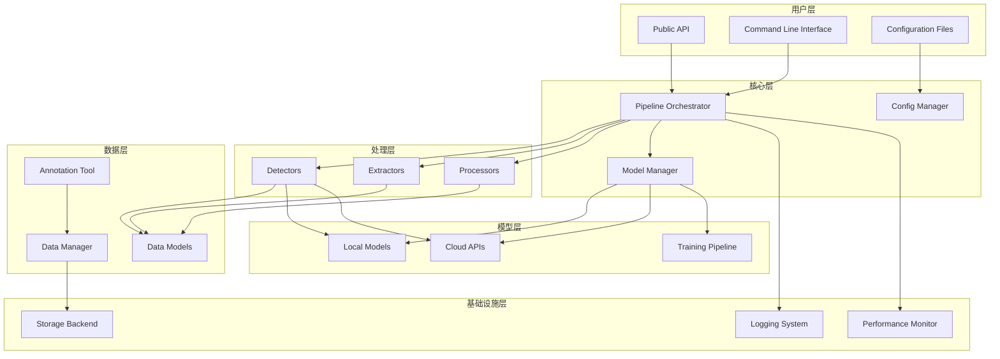

# Design Document: 聊天截图分析库重构

## Overview

本设计文档描述了聊天截图分析库的全面重构方案。重构的核心目标是将现有的单一用途库转变为一个通用的、可扩展的聊天截图分析框架，支持从数据标注到模型部署的完整工作流。

### 当前系统分析

现有系统主要包含以下组件：
- `ChatLayoutDetector`: 聊天布局检测器，使用KMeans聚类识别双列布局
- `ChatTextRecognition`: 文本识别模块，基于PaddleOCR
- `ChatLayoutAnalyzer`: 基于PP-DocLayoutV2的版面分析器
- `NicknameExtractor`: 昵称提取模块，使用综合评分系统
- `TextBox`: 基础数据模型

### 重构目标

1. **模块化架构**: 将功能划分为独立、可替换的模块
2. **技术路径灵活性**: 支持OCR、深度学习、传统CV、云端API等多种技术
3. **完整工作流**: 覆盖数据标注、模型训练、模型部署全流程
4. **向后兼容**: 保持现有API的兼容性
5. **可扩展性**: 通过插件机制支持第三方扩展

## Architecture

### 系统架构图



### 模块职责

#### 1. 核心层 (Core Layer)

**Pipeline Orchestrator (流水线编排器)**
- 职责: 管理处理步骤的执行顺序和数据流
- 功能: 支持顺序执行、并行执行、条件分支
- 接口: `execute()`, `add_step()`, `validate()`

**Config Manager (配置管理器)**
- 职责: 统一管理所有配置参数
- 功能: 分层配置、配置验证、配置持久化
- 接口: `get()`, `set()`, `load()`, `save()`

**Model Manager (模型管理器)**
- 职责: 管理模型的加载、缓存、版本控制
- 功能: 模型注册、版本管理、性能追踪
- 接口: `register()`, `load()`, `list_versions()`


#### 2. 处理层 (Processing Layer)

**Detectors (检测器)**
- 职责: 检测图像中的特定元素
- 实现: TextDetector, AvatarDetector, EmojiDetector, BubbleDetector
- 基类: `BaseDetector`

**Extractors (提取器)**
- 职责: 从检测结果中提取结构化信息
- 实现: NicknameExtractor, SpeakerExtractor, LayoutExtractor, DialogExtractor
- 基类: `BaseExtractor`

**Processors (处理器)**
- 职责: 对数据进行转换和增强
- 实现: ImagePreprocessor, ResultPostprocessor
- 基类: `BaseProcessor`

#### 3. 数据层 (Data Layer)

**Data Models (数据模型)**
- 职责: 定义标准数据结构
- 模型: TextBox, Avatar, Emoji, Bubble, Dialog, AnnotationData

**Data Manager (数据管理器)**
- 职责: 管理数据集的导入、导出、版本控制
- 功能: 数据集划分、数据增强、格式转换

**Annotation Tool (标注工具)**
- 职责: 提供数据标注功能
- 功能: 边界框标注、分类标注、导出标准格式

#### 4. 模型层 (Model Layer)

**Local Models (本地模型)**
- 支持: PaddleOCR, YOLO, Faster R-CNN, 传统CV算法
- 接口: 统一的推理接口

**Cloud APIs (云端API)**
- 支持: GPT-4V, Claude, Gemini
- 功能: 认证管理、速率限制、成本追踪

**Training Pipeline (训练流水线)**
- 功能: 数据准备、模型训练、评估、导出
- 支持: 迁移学习、超参数调优、实验跟踪

## Components and Interfaces

### 1. BaseDetector (检测器基类)

```python
from abc import ABC, abstractmethod
from typing import List, Dict, Any
import numpy as np

class DetectionResult:
    """检测结果数据类"""
    def __init__(self, bbox: List[float], score: float, 
                 category: str, metadata: Dict[str, Any] = None):
        self.bbox = bbox  # [x_min, y_min, x_max, y_max]
        self.score = score
        self.category = category
        self.metadata = metadata or {}

class BaseDetector(ABC):
    """检测器抽象基类"""
    
    def __init__(self, config: Dict[str, Any] = None):
        self.config = config or {}
        self.model = None
    
    @abstractmethod
    def load_model(self) -> None:
        """加载模型"""
        pass
    
    @abstractmethod
    def detect(self, image: np.ndarray) -> List[DetectionResult]:
        """
        执行检测
        
        Args:
            image: 输入图像 (numpy array)
        
        Returns:
            检测结果列表
        """
        pass
    
    def preprocess(self, image: np.ndarray) -> np.ndarray:
        """预处理图像"""
        return image
    
    def postprocess(self, raw_results: Any) -> List[DetectionResult]:
        """后处理原始结果"""
        return raw_results
```


### 2. BaseExtractor (提取器基类)

```python
from abc import ABC, abstractmethod
from typing import List, Dict, Any

class ExtractionResult:
    """提取结果数据类"""
    def __init__(self, data: Dict[str, Any], confidence: float = 1.0):
        self.data = data
        self.confidence = confidence
    
    def to_json(self) -> Dict[str, Any]:
        """转换为JSON格式"""
        return {
            'data': self.data,
            'confidence': self.confidence
        }

class BaseExtractor(ABC):
    """提取器抽象基类"""
    
    def __init__(self, config: Dict[str, Any] = None):
        self.config = config or {}
    
    @abstractmethod
    def extract(self, detection_results: List[DetectionResult], 
                image: np.ndarray = None) -> ExtractionResult:
        """
        从检测结果中提取信息
        
        Args:
            detection_results: 检测结果列表
            image: 可选的原始图像
        
        Returns:
            提取结果
        """
        pass
    
    def validate(self, result: ExtractionResult) -> bool:
        """验证提取结果的有效性"""
        return True
```

### 3. Pipeline (流水线)

```python
from typing import List, Dict, Any, Callable
from enum import Enum

class StepType(Enum):
    DETECTOR = "detector"
    EXTRACTOR = "extractor"
    PROCESSOR = "processor"

class PipelineStep:
    """流水线步骤"""
    def __init__(self, name: str, step_type: StepType, 
                 component: Any, config: Dict[str, Any] = None):
        self.name = name
        self.step_type = step_type
        self.component = component
        self.config = config or {}
        self.enabled = True

class Pipeline:
    """处理流水线"""
    
    def __init__(self, name: str = "default"):
        self.name = name
        self.steps: List[PipelineStep] = []
        self.context: Dict[str, Any] = {}
    
    def add_step(self, step: PipelineStep) -> 'Pipeline':
        """添加处理步骤"""
        self.steps.append(step)
        return self
    
    def execute(self, image: np.ndarray) -> Dict[str, Any]:
        """
        执行流水线
        
        Args:
            image: 输入图像
        
        Returns:
            处理结果字典
        """
        self.context['image'] = image
        self.context['results'] = {}
        
        for step in self.steps:
            if not step.enabled:
                continue
            
            if step.step_type == StepType.DETECTOR:
                results = step.component.detect(image)
                self.context['results'][step.name] = results
            
            elif step.step_type == StepType.EXTRACTOR:
                detection_results = self._get_detection_results(step.config)
                results = step.component.extract(detection_results, image)
                self.context['results'][step.name] = results
        
        return self.context['results']
    
    def _get_detection_results(self, config: Dict[str, Any]) -> List[DetectionResult]:
        """获取指定的检测结果"""
        source = config.get('source', 'text_detector')
        return self.context['results'].get(source, [])
    
    def validate(self) -> bool:
        """验证流水线配置的正确性"""
        # 检查步骤依赖关系
        return True
    
    @classmethod
    def from_config(cls, config: Dict[str, Any]) -> 'Pipeline':
        """从配置文件创建流水线"""
        pipeline = cls(name=config.get('name', 'default'))
        # 解析配置并添加步骤
        return pipeline
```


### 4. ConfigManager (配置管理器)

```python
from typing import Any, Dict, Optional
from pathlib import Path
import yaml
import json

class ConfigManager:
    """配置管理器"""
    
    def __init__(self):
        self.configs: Dict[str, Dict[str, Any]] = {
            'default': {},
            'user': {},
            'runtime': {}
        }
        self.history: List[Dict[str, Any]] = []
    
    def load(self, config_path: str, layer: str = 'user') -> None:
        """
        加载配置文件
        
        Args:
            config_path: 配置文件路径
            layer: 配置层级 (default/user/runtime)
        """
        path = Path(config_path)
        
        if path.suffix == '.yaml' or path.suffix == '.yml':
            with open(path, 'r', encoding='utf-8') as f:
                config = yaml.safe_load(f)
        elif path.suffix == '.json':
            with open(path, 'r', encoding='utf-8') as f:
                config = json.load(f)
        else:
            raise ValueError(f"Unsupported config format: {path.suffix}")
        
        self.configs[layer] = config
    
    def get(self, key: str, default: Any = None) -> Any:
        """
        获取配置值（支持点号分隔的嵌套键）
        
        优先级: runtime > user > default
        """
        keys = key.split('.')
        
        for layer in ['runtime', 'user', 'default']:
            value = self.configs[layer]
            try:
                for k in keys:
                    value = value[k]
                return value
            except (KeyError, TypeError):
                continue
        
        return default
    
    def set(self, key: str, value: Any, layer: str = 'runtime') -> None:
        """设置配置值"""
        keys = key.split('.')
        config = self.configs[layer]
        
        for k in keys[:-1]:
            if k not in config:
                config[k] = {}
            config = config[k]
        
        config[keys[-1]] = value
    
    def save(self, config_path: str, layer: str = 'user') -> None:
        """保存配置到文件"""
        path = Path(config_path)
        path.parent.mkdir(parents=True, exist_ok=True)
        
        config = self.configs[layer]
        
        if path.suffix == '.yaml' or path.suffix == '.yml':
            with open(path, 'w', encoding='utf-8') as f:
                yaml.dump(config, f, allow_unicode=True)
        elif path.suffix == '.json':
            with open(path, 'w', encoding='utf-8') as f:
                json.dump(config, f, indent=2, ensure_ascii=False)
    
    def validate(self, schema: Dict[str, Any]) -> bool:
        """验证配置的有效性"""
        # 使用jsonschema或自定义验证逻辑
        return True
```

### 5. ModelManager (模型管理器)

```python
from typing import Dict, Any, Optional, List
from pathlib import Path
import json
from datetime import datetime

class ModelMetadata:
    """模型元数据"""
    def __init__(self, name: str, version: str, 
                 model_type: str, framework: str):
        self.name = name
        self.version = version
        self.model_type = model_type
        self.framework = framework
        self.created_at = datetime.now()
        self.metrics: Dict[str, float] = {}
        self.tags: List[str] = []
        self.description: str = ""

class ModelManager:
    """模型管理器"""
    
    def __init__(self, model_dir: str = "models"):
        self.model_dir = Path(model_dir)
        self.model_dir.mkdir(parents=True, exist_ok=True)
        self.registry: Dict[str, ModelMetadata] = {}
        self.cache: Dict[str, Any] = {}
        self._load_registry()
    
    def register(self, metadata: ModelMetadata, model_path: str) -> None:
        """注册模型"""
        model_id = f"{metadata.name}:{metadata.version}"
        self.registry[model_id] = metadata
        self._save_registry()
    
    def load(self, name: str, version: str = "latest") -> Any:
        """加载模型"""
        model_id = f"{name}:{version}"
        
        # 检查缓存
        if model_id in self.cache:
            return self.cache[model_id]
        
        # 从磁盘加载
        metadata = self.registry.get(model_id)
        if metadata is None:
            raise ValueError(f"Model not found: {model_id}")
        
        # 根据框架加载模型
        model = self._load_model_by_framework(metadata)
        self.cache[model_id] = model
        
        return model
    
    def list_versions(self, name: str) -> List[str]:
        """列出模型的所有版本"""
        versions = []
        for model_id, metadata in self.registry.items():
            if metadata.name == name:
                versions.append(metadata.version)
        return sorted(versions)
    
    def _load_registry(self) -> None:
        """加载模型注册表"""
        registry_path = self.model_dir / "registry.json"
        if registry_path.exists():
            with open(registry_path, 'r') as f:
                data = json.load(f)
                # 反序列化为ModelMetadata对象
    
    def _save_registry(self) -> None:
        """保存模型注册表"""
        registry_path = self.model_dir / "registry.json"
        with open(registry_path, 'w') as f:
            # 序列化registry
            json.dump({}, f, indent=2)
    
    def _load_model_by_framework(self, metadata: ModelMetadata) -> Any:
        """根据框架加载模型"""
        # 实现不同框架的模型加载逻辑
        pass
```


## Data Models

### 核心数据模型

```python
from dataclasses import dataclass, field
from typing import List, Dict, Any, Optional
import numpy as np

@dataclass
class TextBox:
    """文本框数据模型（保持向后兼容）"""
    box: np.ndarray  # [x_min, y_min, x_max, y_max]
    score: float
    text: Optional[str] = None
    text_type: Optional[str] = None
    source: Optional[str] = None
    speaker: Optional[str] = None
    layout_det: Optional[Any] = None
    related_layout_boxes: List[Any] = field(default_factory=list)
    
    @property
    def x_min(self) -> float:
        return float(self.box[0])
    
    @property
    def y_min(self) -> float:
        return float(self.box[1])
    
    @property
    def x_max(self) -> float:
        return float(self.box[2])
    
    @property
    def y_max(self) -> float:
        return float(self.box[3])
    
    @property
    def center_x(self) -> float:
        return (self.x_min + self.x_max) / 2
    
    @property
    def center_y(self) -> float:
        return (self.y_min + self.y_max) / 2
    
    @property
    def width(self) -> float:
        return self.x_max - self.x_min
    
    @property
    def height(self) -> float:
        return self.y_max - self.y_min

@dataclass
class Avatar:
    """头像数据模型"""
    bbox: List[float]  # [x_min, y_min, x_max, y_max]
    score: float
    speaker_id: Optional[str] = None
    image_crop: Optional[np.ndarray] = None

@dataclass
class Emoji:
    """表情数据模型"""
    bbox: List[float]
    score: float
    emoji_type: Optional[str] = None
    image_crop: Optional[np.ndarray] = None

@dataclass
class Bubble:
    """聊天气泡数据模型"""
    bbox: List[float]
    text_boxes: List[TextBox] = field(default_factory=list)
    avatar: Optional[Avatar] = None
    emojis: List[Emoji] = field(default_factory=list)
    speaker: Optional[str] = None
    timestamp: Optional[str] = None

@dataclass
class Dialog:
    """对话数据模型"""
    bubbles: List[Bubble] = field(default_factory=list)
    layout_type: str = "unknown"  # single, double, double_left, double_right
    speakers: Dict[str, Any] = field(default_factory=dict)
    metadata: Dict[str, Any] = field(default_factory=dict)
    
    def to_json(self) -> Dict[str, Any]:
        """转换为JSON格式"""
        return {
            'layout_type': self.layout_type,
            'speakers': self.speakers,
            'bubbles': [
                {
                    'bbox': bubble.bbox,
                    'speaker': bubble.speaker,
                    'text': ' '.join([tb.text for tb in bubble.text_boxes if tb.text]),
                    'timestamp': bubble.timestamp
                }
                for bubble in self.bubbles
            ],
            'metadata': self.metadata
        }

@dataclass
class AnnotationData:
    """标注数据模型"""
    image_path: str
    image_size: tuple  # (width, height)
    annotations: List[Dict[str, Any]] = field(default_factory=list)
    metadata: Dict[str, Any] = field(default_factory=dict)
    
    def to_coco(self) -> Dict[str, Any]:
        """转换为COCO格式"""
        # 实现COCO格式转换
        pass
    
    def to_yolo(self) -> str:
        """转换为YOLO格式"""
        # 实现YOLO格式转换
        pass
```


## Correctness Properties

A property is a characteristic or behavior that should hold true across all valid executions of a system—essentially, a formal statement about what the system should do. Properties serve as the bridge between human-readable specifications and machine-verifiable correctness guarantees.

### Property 1: Module Interface Consistency
*For any* two modules that need to communicate, they should only interact through defined public interfaces and not access each other's internal state directly.
**Validates: Requirements 1.2**

### Property 2: Pipeline Configuration Round-Trip
*For any* valid pipeline configuration, saving it to a file and then loading it back should produce an equivalent pipeline that executes identically.
**Validates: Requirements 8.7**

### Property 3: Unified Data Model Acceptance
*For any* module (detector, extractor, or processor), it should accept and return data using the standard data models (TextBox, DetectionResult, ExtractionResult).
**Validates: Requirements 1.5**

### Property 4: Batch Image Import Completeness
*For any* list of valid image file paths, the batch import function should successfully import all images without data loss.
**Validates: Requirements 2.1**

### Property 5: Annotation Data Completeness
*For any* annotation (bubble, avatar, or emoji), all required fields specified in the requirements should be present in the stored annotation data.
**Validates: Requirements 2.3, 2.4, 2.5**

### Property 6: Annotation Format Round-Trip
*For any* annotation dataset, exporting to a standard format (COCO/YOLO/JSON) and then importing back should preserve all annotation information.
**Validates: Requirements 2.6**

### Property 7: Detector Interface Conformance
*For any* detector implementation (OCR, deep learning, traditional CV, or cloud API), it should conform to the BaseDetector interface and return List[DetectionResult].
**Validates: Requirements 3.5, 6.6**

### Property 8: Detector Configuration Application
*For any* valid detector configuration, applying it to a detector should change its behavior according to the specified parameters.
**Validates: Requirements 6.7**

### Property 9: Extractor JSON Output Validity
*For any* extractor output, calling to_json() should produce valid, parseable JSON that contains all extracted information.
**Validates: Requirements 7.6**

### Property 10: Extractor Chain Composition
*For any* sequence of compatible extractors, composing them should produce a result equivalent to applying each extractor in order.
**Validates: Requirements 7.7**

### Property 11: Pipeline Execution Order Preservation
*For any* pipeline configuration specifying an execution order, the actual execution should follow that exact order and produce deterministic results.
**Validates: Requirements 8.2**

### Property 12: Pipeline Conditional Branch Correctness
*For any* pipeline with conditional branches, the branch taken should match the condition evaluation based on intermediate results.
**Validates: Requirements 8.3**

### Property 13: Pipeline Parallel Execution Completeness
*For any* pipeline with parallel steps, all parallel steps should execute and their results should be correctly merged.
**Validates: Requirements 8.4**

### Property 14: Pipeline Validation Failure Detection
*For any* invalid pipeline configuration (missing dependencies, circular references, invalid step types), the validation function should fail and provide a clear error message.
**Validates: Requirements 8.5**

### Property 15: Pipeline Metrics Recording
*For any* pipeline execution, performance metrics (execution time, memory usage) for each step should be recorded and accessible.
**Validates: Requirements 8.6**

### Property 16: Configuration Layer Priority
*For any* configuration key present in multiple layers, the get() method should return the value from the highest priority layer (runtime > user > default).
**Validates: Requirements 9.1**

### Property 17: Configuration Inheritance and Override
*For any* hierarchical configuration, child configuration values should override parent values while preserving non-overridden parent values.
**Validates: Requirements 9.2**

### Property 18: Configuration History Preservation
*For any* configuration modification, the previous version should be stored in history and be retrievable.
**Validates: Requirements 9.3**

### Property 19: Configuration Validation Rejection
*For any* invalid configuration value (wrong type, out of range, missing required field), the validation function should reject it with a descriptive error.
**Validates: Requirements 9.4**

### Property 20: Environment Variable Override
*For any* configuration key with both a config file value and an environment variable, the environment variable value should take precedence.
**Validates: Requirements 9.5**

### Property 21: Configuration Export-Import Round-Trip
*For any* configuration state, exporting to a file and importing back should restore the exact same configuration.
**Validates: Requirements 9.7**

### Property 22: Model Metadata Completeness
*For any* registered model, all required metadata fields (name, version, type, framework, metrics) should be stored and retrievable.
**Validates: Requirements 10.1, 10.4**

### Property 23: Model Version Loading Correctness
*For any* registered model with multiple versions, loading by version number or tag should return the correct model instance.
**Validates: Requirements 10.3**

### Property 24: Model Cache Consistency
*For any* model, loading it multiple times should return the same cached instance (not reload from disk).
**Validates: Requirements 10.6**

### Property 25: Model Export-Import Round-Trip
*For any* model, exporting its metadata and weights, then importing them back should produce a functionally equivalent model.
**Validates: Requirements 10.7**

### Property 26: Backward Compatibility Preservation
*For any* code using the legacy ChatLayoutDetector or TextBox API, it should execute without errors and produce equivalent results to the old implementation.
**Validates: Requirements 15.1, 15.2, 15.3**

### Property 27: Deprecation Warning Emission
*For any* call to a deprecated API function, a deprecation warning should be logged exactly once per unique call site.
**Validates: Requirements 15.4**


## Error Handling

### Exception Hierarchy

```python
class ScreenshotAnalysisError(Exception):
    """基础异常类"""
    pass

class ConfigurationError(ScreenshotAnalysisError):
    """配置相关错误"""
    pass

class ModelError(ScreenshotAnalysisError):
    """模型相关错误"""
    pass

class ModelLoadError(ModelError):
    """模型加载失败"""
    pass

class ModelNotFoundError(ModelError):
    """模型未找到"""
    pass

class DetectionError(ScreenshotAnalysisError):
    """检测过程错误"""
    pass

class ExtractionError(ScreenshotAnalysisError):
    """提取过程错误"""
    pass

class PipelineError(ScreenshotAnalysisError):
    """流水线执行错误"""
    pass

class ValidationError(ScreenshotAnalysisError):
    """验证错误"""
    pass

class DataError(ScreenshotAnalysisError):
    """数据相关错误"""
    pass
```

### Error Handling Strategy

1. **Fail Fast**: 在配置加载和验证阶段尽早发现错误
2. **Graceful Degradation**: 在检测失败时提供fallback机制
3. **Detailed Logging**: 记录完整的错误上下文和堆栈跟踪
4. **Recovery Suggestions**: 在错误消息中提供可能的解决方案

### Logging System

```python
import logging
from typing import Dict, Any

class StructuredLogger:
    """结构化日志记录器"""
    
    def __init__(self, name: str):
        self.logger = logging.getLogger(name)
        self.context: Dict[str, Any] = {}
    
    def set_context(self, **kwargs) -> None:
        """设置日志上下文"""
        self.context.update(kwargs)
    
    def info(self, message: str, **kwargs) -> None:
        """记录INFO级别日志"""
        extra = {**self.context, **kwargs}
        self.logger.info(message, extra=extra)
    
    def error(self, message: str, exc_info: bool = True, **kwargs) -> None:
        """记录ERROR级别日志"""
        extra = {**self.context, **kwargs}
        self.logger.error(message, exc_info=exc_info, extra=extra)
    
    def warning(self, message: str, **kwargs) -> None:
        """记录WARNING级别日志"""
        extra = {**self.context, **kwargs}
        self.logger.warning(message, extra=extra)
```

## Testing Strategy

### Dual Testing Approach

本系统采用单元测试和属性测试相结合的策略：

**Unit Tests (单元测试)**:
- 验证具体的示例和边缘情况
- 测试特定的错误条件
- 测试模块间的集成点
- 使用pytest框架

**Property-Based Tests (属性测试)**:
- 验证通用属性在所有输入下都成立
- 使用Hypothesis库生成随机测试数据
- 每个属性测试至少运行100次迭代
- 每个测试必须引用设计文档中的属性编号

### Testing Framework

使用pytest作为主要测试框架，配合以下工具：
- **Hypothesis**: 属性测试库
- **pytest-cov**: 代码覆盖率
- **pytest-mock**: Mock和stub
- **pytest-benchmark**: 性能基准测试

### Test Organization

```
tests/
├── unit/                    # 单元测试
│   ├── test_detectors.py
│   ├── test_extractors.py
│   ├── test_pipeline.py
│   ├── test_config.py
│   └── test_models.py
├── integration/             # 集成测试
│   ├── test_full_pipeline.py
│   └── test_api.py
├── property/                # 属性测试
│   ├── test_properties_core.py
│   ├── test_properties_data.py
│   └── test_properties_config.py
├── e2e/                     # 端到端测试
│   └── test_scenarios.py
└── conftest.py              # pytest配置
```

### Property Test Example

```python
from hypothesis import given, strategies as st
import pytest

@given(st.lists(st.text(min_size=1), min_size=1))
def test_property_2_pipeline_config_roundtrip(config_data):
    """
    Feature: screenshot-analysis-library-refactor
    Property 2: Pipeline Configuration Round-Trip
    
    For any valid pipeline configuration, saving and loading 
    should produce an equivalent pipeline.
    """
    # Create pipeline from config
    pipeline1 = Pipeline.from_config(config_data)
    
    # Save to file
    temp_file = "temp_config.yaml"
    pipeline1.save(temp_file)
    
    # Load from file
    pipeline2 = Pipeline.load(temp_file)
    
    # Execute both pipelines on same input
    test_image = generate_test_image()
    result1 = pipeline1.execute(test_image)
    result2 = pipeline2.execute(test_image)
    
    # Results should be identical
    assert result1 == result2
```

### Test Coverage Goals

- 单元测试覆盖率: >90%
- 集成测试覆盖率: >80%
- 属性测试: 所有27个属性都有对应测试
- 端到端测试: 覆盖主要使用场景

### Continuous Integration

使用GitHub Actions进行持续集成：
- 每次提交运行所有测试
- 每天运行完整的属性测试套件（更多迭代）
- 生成覆盖率报告
- 性能回归检测


## Implementation Details

### 1. Detector Implementations

#### TextDetector

```python
class TextDetector(BaseDetector):
    """文本检测器（支持多种后端）"""
    
    def __init__(self, backend: str = "paddleocr", config: Dict[str, Any] = None):
        super().__init__(config)
        self.backend = backend
        self.supported_backends = ["paddleocr", "tesseract", "easyocr"]
    
    def load_model(self) -> None:
        if self.backend == "paddleocr":
            from paddleocr import TextDetection
            model_dir = self.config.get('model_dir', 'models/PP-OCRv5_server_det/')
            self.model = TextDetection(
                model_name="PP-OCRv5_server_det",
                model_dir=model_dir
            )
        elif self.backend == "tesseract":
            import pytesseract
            self.model = pytesseract
        else:
            raise ValueError(f"Unsupported backend: {self.backend}")
    
    def detect(self, image: np.ndarray) -> List[DetectionResult]:
        if self.backend == "paddleocr":
            results = self.model.predict(image)
            return self._convert_paddle_results(results)
        elif self.backend == "tesseract":
            # Tesseract implementation
            pass
```

#### BubbleDetector

```python
class BubbleDetector(BaseDetector):
    """聊天气泡检测器（基于ChatLayoutDetector）"""
    
    def __init__(self, config: Dict[str, Any] = None):
        super().__init__(config)
        self.screen_width = config.get('screen_width', 720)
        self.layout_detector = None
    
    def load_model(self) -> None:
        from screenshotanalysis.chat_layout_detector import ChatLayoutDetector
        self.layout_detector = ChatLayoutDetector(
            screen_width=self.screen_width,
            memory_path=self.config.get('memory_path')
        )
    
    def detect(self, image: np.ndarray) -> List[DetectionResult]:
        # 首先需要文本框检测结果
        # 这里展示如何与Pipeline集成
        pass
```

### 2. Extractor Implementations

#### NicknameExtractor

```python
class NicknameExtractor(BaseExtractor):
    """昵称提取器（基于现有实现）"""
    
    def __init__(self, config: Dict[str, Any] = None):
        super().__init__(config)
        self.top_k = config.get('top_k', 3)
        self.min_top_margin_ratio = config.get('min_top_margin_ratio', 0.05)
        self.top_region_ratio = config.get('top_region_ratio', 0.2)
    
    def extract(self, detection_results: List[DetectionResult], 
                image: np.ndarray = None) -> ExtractionResult:
        """
        从文本检测结果中提取昵称候选
        """
        # 转换DetectionResult为TextBox
        text_boxes = self._convert_to_textboxes(detection_results)
        
        # 使用现有的昵称提取逻辑
        from screenshotanalysis.nickname_extractor import extract_nicknames_from_text_boxes
        
        candidates = extract_nicknames_from_text_boxes(
            text_boxes=text_boxes,
            image=image,
            processor=self.processor,
            top_k=self.top_k,
            min_top_margin_ratio=self.min_top_margin_ratio,
            top_region_ratio=self.top_region_ratio
        )
        
        return ExtractionResult(
            data={'nicknames': candidates},
            confidence=candidates[0]['nickname_score'] / 100 if candidates else 0.0
        )
```

#### SpeakerExtractor

```python
class SpeakerExtractor(BaseExtractor):
    """说话者识别提取器"""
    
    def extract(self, detection_results: List[DetectionResult], 
                image: np.ndarray = None) -> ExtractionResult:
        """
        从气泡检测结果中识别说话者
        """
        # 使用ChatLayoutDetector的说话者推断逻辑
        pass
```

### 3. Pipeline Configuration Format

#### YAML Configuration Example

```yaml
name: "chat_analysis_pipeline"
version: "1.0"

steps:
  - name: "text_detection"
    type: "detector"
    class: "TextDetector"
    config:
      backend: "paddleocr"
      model_dir: "models/PP-OCRv5_server_det/"
    enabled: true
  
  - name: "bubble_detection"
    type: "detector"
    class: "BubbleDetector"
    config:
      screen_width: 720
      memory_path: "chat_memory.json"
    depends_on: ["text_detection"]
    enabled: true
  
  - name: "nickname_extraction"
    type: "extractor"
    class: "NicknameExtractor"
    config:
      source: "text_detection"
      top_k: 3
    enabled: true
  
  - name: "speaker_extraction"
    type: "extractor"
    class: "SpeakerExtractor"
    config:
      source: "bubble_detection"
    enabled: true

output:
  format: "json"
  include_metadata: true
```

### 4. Backward Compatibility Layer

```python
# 兼容层：保持旧API可用
from screenshotanalysis.core import ChatLayoutDetector as NewChatLayoutDetector
import warnings

class ChatLayoutDetector:
    """向后兼容的ChatLayoutDetector包装器"""
    
    def __init__(self, *args, **kwargs):
        warnings.warn(
            "ChatLayoutDetector is deprecated. Use Pipeline with BubbleDetector instead.",
            DeprecationWarning,
            stacklevel=2
        )
        self._detector = NewChatLayoutDetector(*args, **kwargs)
    
    def process_frame(self, boxes, **kwargs):
        """保持旧接口"""
        return self._detector.process_frame(boxes, **kwargs)
    
    # 其他旧方法...
```

### 5. Cloud API Integration

```python
class CloudVisionDetector(BaseDetector):
    """云端视觉API检测器"""
    
    def __init__(self, provider: str = "openai", config: Dict[str, Any] = None):
        super().__init__(config)
        self.provider = provider
        self.api_key = config.get('api_key')
        self.rate_limiter = RateLimiter(config.get('rate_limit', 10))
        self.cost_tracker = CostTracker()
    
    def load_model(self) -> None:
        if self.provider == "openai":
            import openai
            openai.api_key = self.api_key
            self.client = openai
        elif self.provider == "anthropic":
            import anthropic
            self.client = anthropic.Client(api_key=self.api_key)
        # 其他provider...
    
    def detect(self, image: np.ndarray) -> List[DetectionResult]:
        # 速率限制
        self.rate_limiter.wait_if_needed()
        
        # 调用API
        response = self._call_api(image)
        
        # 记录成本
        self.cost_tracker.record(response)
        
        return self._parse_response(response)
```

### 6. Training Pipeline

```python
class TrainingPipeline:
    """模型训练流水线"""
    
    def __init__(self, config: Dict[str, Any]):
        self.config = config
        self.data_manager = DataManager()
        self.model_manager = ModelManager()
        self.experiment_tracker = ExperimentTracker()
    
    def prepare_data(self, dataset_path: str) -> Tuple[Dataset, Dataset, Dataset]:
        """准备训练数据"""
        # 加载数据集
        dataset = self.data_manager.load_dataset(dataset_path)
        
        # 划分数据集
        train_ratio = self.config.get('train_ratio', 0.7)
        val_ratio = self.config.get('val_ratio', 0.15)
        
        train_ds, val_ds, test_ds = dataset.split(train_ratio, val_ratio)
        
        # 数据增强
        if self.config.get('augmentation', True):
            train_ds = self._apply_augmentation(train_ds)
        
        return train_ds, val_ds, test_ds
    
    def train(self, model_type: str, train_ds: Dataset, val_ds: Dataset) -> Model:
        """训练模型"""
        # 创建模型
        model = self._create_model(model_type)
        
        # 训练循环
        for epoch in range(self.config.get('epochs', 100)):
            train_loss = self._train_epoch(model, train_ds)
            val_loss = self._validate_epoch(model, val_ds)
            
            # 记录指标
            self.experiment_tracker.log_metrics({
                'epoch': epoch,
                'train_loss': train_loss,
                'val_loss': val_loss
            })
            
            # 早停
            if self._should_stop_early(val_loss):
                break
        
        return model
    
    def evaluate(self, model: Model, test_ds: Dataset) -> Dict[str, float]:
        """评估模型"""
        metrics = {}
        # 计算各种指标
        return metrics
```

### 7. Performance Monitoring

```python
class PerformanceMonitor:
    """性能监控器"""
    
    def __init__(self):
        self.metrics: Dict[str, List[float]] = {}
        self.start_times: Dict[str, float] = {}
    
    def start_timer(self, name: str) -> None:
        """开始计时"""
        import time
        self.start_times[name] = time.time()
    
    def stop_timer(self, name: str) -> float:
        """停止计时并记录"""
        import time
        if name not in self.start_times:
            raise ValueError(f"Timer {name} was not started")
        
        elapsed = time.time() - self.start_times[name]
        
        if name not in self.metrics:
            self.metrics[name] = []
        self.metrics[name].append(elapsed)
        
        del self.start_times[name]
        return elapsed
    
    def get_stats(self, name: str) -> Dict[str, float]:
        """获取统计信息"""
        if name not in self.metrics:
            return {}
        
        values = self.metrics[name]
        return {
            'mean': np.mean(values),
            'std': np.std(values),
            'min': np.min(values),
            'max': np.max(values),
            'count': len(values)
        }
    
    def generate_report(self) -> str:
        """生成性能报告"""
        report = "Performance Report\n"
        report += "=" * 50 + "\n"
        
        for name in self.metrics:
            stats = self.get_stats(name)
            report += f"\n{name}:\n"
            report += f"  Mean: {stats['mean']:.3f}s\n"
            report += f"  Std:  {stats['std']:.3f}s\n"
            report += f"  Min:  {stats['min']:.3f}s\n"
            report += f"  Max:  {stats['max']:.3f}s\n"
            report += f"  Count: {stats['count']}\n"
        
        return report
```


## Migration Strategy

### Phase 1: Core Architecture (Weeks 1-3)

**目标**: 建立新架构的基础

1. **创建基础抽象类**
   - 实现BaseDetector, BaseExtractor, BaseProcessor
   - 定义统一的数据模型
   - 创建Pipeline基础框架

2. **迁移现有检测器**
   - 将ChatLayoutDetector包装为BubbleDetector
   - 将ChatTextRecognition包装为TextDetector
   - 保持原有功能不变

3. **建立向后兼容层**
   - 创建旧API的包装器
   - 添加弃用警告
   - 编写迁移文档

**验收标准**:
- 所有现有测试通过
- 新旧API都能正常工作
- 性能无明显下降

### Phase 2: Configuration and Pipeline (Weeks 4-5)

**目标**: 实现配置管理和流水线编排

1. **实现ConfigManager**
   - 分层配置支持
   - 配置验证
   - 配置持久化

2. **完善Pipeline**
   - 支持YAML/JSON配置
   - 实现条件分支和并行执行
   - 添加性能监控

3. **多技术路径支持**
   - 统一接口设计
   - 实现不同后端的切换

**验收标准**:
- 可以通过配置文件定义流水线
- 支持至少2种技术路径
- 流水线验证功能正常

### Phase 3: Data and Model Management (Weeks 6-9)

**目标**: 支持完整的数据到模型工作流

1. **数据管理**
   - 实现DataManager
   - 标注工具原型
   - 格式转换功能

2. **模型训练**
   - 实现TrainingPipeline
   - 数据增强
   - 实验跟踪

3. **模型管理**
   - 实现ModelManager
   - 版本管理
   - 模型缓存

**验收标准**:
- 可以导入导出标注数据
- 可以训练自定义模型
- 模型版本管理正常工作

### Phase 4: Deployment and Optimization (Weeks 10-12)

**目标**: 支持多种部署场景

1. **部署支持**
   - REST API实现
   - 模型格式转换
   - 部署配置模板

2. **性能优化**
   - 批量处理
   - 并行化
   - 内存优化

3. **边缘设备支持**
   - 模型量化
   - 移动端SDK

**验收标准**:
- REST API可用
- 批量处理性能提升50%+
- 支持至少一种移动端框架

### Phase 5: Advanced Features (Weeks 13-15)

**目标**: 增强系统能力

1. **云端API集成**
   - GPT-4V集成
   - Claude集成
   - 成本追踪

2. **安全和隐私**
   - 本地处理模式
   - 数据脱敏
   - 访问日志

3. **文档和示例**
   - API文档
   - 用户指南
   - 示例代码

**验收标准**:
- 至少支持2个云端API
- 隐私保护功能完整
- 文档覆盖所有主要功能

## Deployment Architecture

### Server Deployment

```
┌─────────────────────────────────────────┐
│         Load Balancer (Nginx)           │
└─────────────────────────────────────────┘
                    │
        ┌───────────┴───────────┐
        │                       │
┌───────▼────────┐    ┌────────▼────────┐
│  API Server 1  │    │  API Server 2   │
│  (FastAPI)     │    │  (FastAPI)      │
└───────┬────────┘    └────────┬────────┘
        │                       │
        └───────────┬───────────┘
                    │
        ┌───────────▼───────────┐
        │   Model Manager       │
        │   (Shared Cache)      │
        └───────────┬───────────┘
                    │
        ┌───────────▼───────────┐
        │   Storage Backend     │
        │   (S3/MinIO)          │
        └───────────────────────┘
```

### Edge Deployment

```
┌─────────────────────────────────────────┐
│         Mobile Application              │
│  ┌─────────────────────────────────┐   │
│  │   Screenshot Analysis SDK       │   │
│  │  ┌──────────────────────────┐   │   │
│  │  │  Quantized Models        │   │   │
│  │  │  (TFLite/NCNN/MNN)       │   │   │
│  │  └──────────────────────────┘   │   │
│  │  ┌──────────────────────────┐   │   │
│  │  │  Local Processing        │   │   │
│  │  └──────────────────────────┘   │   │
│  └─────────────────────────────────┘   │
└─────────────────────────────────────────┘
```

## Security Considerations

### Data Privacy

1. **本地处理优先**: 默认在本地处理图像，不上传到云端
2. **数据脱敏**: 在使用云端API前自动检测和过滤敏感信息
3. **加密存储**: 支持对标注数据和模型进行加密存储
4. **访问控制**: 记录所有数据访问日志

### API Security

1. **认证**: 支持API Key和OAuth 2.0
2. **速率限制**: 防止API滥用
3. **输入验证**: 严格验证所有输入参数
4. **HTTPS**: 强制使用HTTPS传输

## Performance Targets

### Latency Targets

- 文本检测: <200ms (单张图片, GPU)
- 气泡检测: <100ms (基于已有文本框)
- 昵称提取: <50ms
- 完整流水线: <500ms (GPU), <2s (CPU)

### Throughput Targets

- 批量处理: >100 images/minute (GPU)
- 并行处理: 线性扩展到8核
- API响应: >1000 requests/minute

### Resource Targets

- 内存占用: <2GB (单个模型)
- 模型大小: <500MB (服务器), <50MB (移动端)
- 磁盘空间: <10GB (包含所有模型)

## Future Enhancements

### Short-term (3-6 months)

1. **更多检测器**: 表情检测、头像检测、时间戳检测
2. **更多提取器**: 对话结构提取、情感分析
3. **Web UI**: 基于浏览器的标注工具
4. **更多云端API**: Google Gemini, Azure Vision

### Medium-term (6-12 months)

1. **自动标注**: 使用大模型辅助标注
2. **主动学习**: 智能选择需要标注的样本
3. **联邦学习**: 支持分布式训练
4. **实时处理**: 支持视频流分析

### Long-term (12+ months)

1. **多模态分析**: 结合文本、图像、音频
2. **跨平台统一**: 支持更多聊天应用
3. **智能推荐**: 基于历史数据推荐最佳配置
4. **自动优化**: 自动调优模型和参数

## Conclusion

本设计文档描述了聊天截图分析库的全面重构方案。通过模块化架构、灵活的技术路径支持、完整的工作流覆盖，新系统将成为一个通用的、可扩展的聊天截图分析框架。

重构将分阶段进行，优先保证向后兼容性和核心功能的稳定性，然后逐步添加新功能。通过属性测试和单元测试的双重保障，确保系统的正确性和可靠性。

最终，这个框架将支持从数据标注到模型部署的完整工作流，满足研究、开发和生产环境的各种需求。
